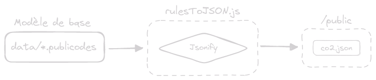
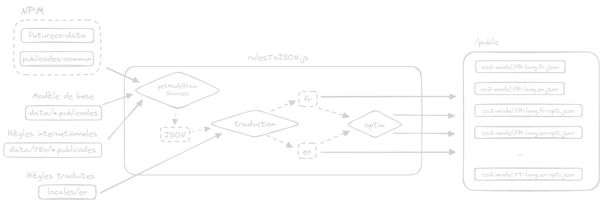

## Introduction

# (Rappel) Nos Gestes Climat

<!-- pause -->

C'est le simulateur d'empreinte carbone individuelle de l'ADEME.

<!-- pause -->

## Comment ça marche ?

<!-- pause -->

1. Vous répondez à un questionnaire sur votre mode de vie
2. Vous obtenez votre empreinte carbone individuelle annuelle totale (et par
   grandes catégories)
3. Vous obtenez des actions personnalisées en fonction de vos réponses

<!-- pause -->

## Techniquement

<!-- pause -->

Il y a deux grandes parties :

<!-- column_layout: [2, 2] -->

<!-- column: 0 -->

<!-- pause -->

**Le modèle de calcul**

Il décrit dans un ensemble de fichiers (écrits en Publicodes), les règles de
calcul de l'empreinte carbone.

<!-- column: 1 -->
<!-- pause -->

**Le simulateur**

Une application React qui utilise le moteur de Publicodes pour évaluer les
règles du modèle en fonction des réponses de l'utilisateur·ice.

<!-- reset_layout -->
<!-- pause -->

_Si vous ne l'avez pas encore fait, je vous invite à aller faire le test :
[](https://nosgestesclimat.fr)_

<!-- end_slide -->

## Introduction

# (Rappel) Publicodes

<!-- column_layout: [2, 3] -->
<!-- pause -->
<!-- column: 0 -->

_"Publicodes est un langage **déclaratif** pour modéliser des **domaines métiers
complexes** en les décomposant en **règles élémentaires simples**."_, [](https://publi.codes)

<!-- pause -->
<!-- column: 1 -->

- Tout est décrit avec des `règles`
- Les calculs plus complexes sont une `composition` de règles plus simples
- Le langage est `simple` et `lisible` par des `non-informaticien·nes`

<!-- pause -->
<!-- reset_layout -->

Par exemple, voici un extrait du modèle de calcul de l'empreinte carbone des animaux
domestiques :

<!-- column_layout: [2, 2] -->

<!-- pause -->

<!-- column: 0 -->

```yaml
divers . animaux domestiques . empreinte totale:
  formule:
    somme:
      - empreinte . chats
      - empreinte . chiens

divers . animaux domestiques . empreinte . chats:
  icônes: 🐱
  titre: Chat
  formule: nombre * empreinte

divers . animaux domestiques . empreinte . chiens:
  formule:
    somme:
      - petit chien
      - chien moyen
      - gros chien
```

<!-- pause -->

<!-- column: 1 -->

```yaml
divers . animaux domestiques . empreinte . chats . nombre:
  question: Combien de chats possédez-vous dans votre foyer ?
  par défaut: 0

divers . animaux domestiques . empreinte . chats . empreinte:
  titre: Empreinte d'un chat de taille moyenne
  description: |
    On considère un chat de taille moyenne (4kg).
  formule:
    somme:
      - alimentation
      - soins vétérinaires par animal
      - litière
  unité: kgCO2e
```

<!-- end_slide -->

## Introduction

# A mon arrivé

<!-- pause -->

Il y avait un seul modèle de calcul :

<!-- column_layout: [2, 2] -->

<!-- column: 0 -->
<!-- pause -->

**Stats**

| Nb. règles | Nb. fichiers | Nb. lignes | Poids  |
| ---------: | ------------ | ---------- | ------ |
|        898 | 31           | 6 527      | 273 Ko |

<!-- column: 1 -->
<!-- pause -->

**Perfs**

|             | Temps de parsing | Temps d'évaluation |
| ----------- | ---------------- | ------------------ |
| local (Bun) | ~340 _ms_        | ~55 _ms_           |

<!-- reset_layout -->

<!-- pause -->

**Workflow**



‎

_Toutes les règles du modèles doivent être **compilées** dans un seul fichier
JSON afin de pouvoir être **évaluées par le moteur dans le navigateur**._

<!-- end_slide -->

## Introduction

# Aujourd'hui

<!-- pause -->

Il y a **36** modèles compilés (17 _régions_ et 2 _langues_) :

<!-- column_layout: [2, 2] -->

<!-- column: 0 -->
<!-- pause -->

**Stats** (modèle de _base_)

| Nb. règles | Nb. fichiers | Nb. lignes | Poids   |
| ---------: | ------------ | ---------- | ------- |
|       1720 | 85           | 16 129     | ~800 Ko |

<!-- column: 1 -->
<!-- pause -->

**Perfs** (modèle de _base_)

|                | Temps de parsing | Temps d'évaluation |
| -------------- | ---------------- | ------------------ |
| local (Node)   | ~660 _ms_        | ~200 _ms_          |
| local (Bun)    | ~700 _ms_        | ~125 _ms_          |
| preview Vercel | ~1200 _ms_       | ~120 _ms_          |

<!-- reset_layout -->

<!-- pause -->

**Workflow**

.png>)

<!-- end_slide -->

## Introduction

# Problématiques

Dans un contexte où le nombre de modèles de calcul augmente, plusieurs
questions s'imposent.

<!-- pause -->

‎

## 1. Une question de performance

Comment `réduire le temps d'instanciation du moteur dans le
navigateur`, afin de pouvoir servir une page interactive le plus rapidement
possible ?

<!-- pause -->

‎

## 2. Une question de maintenabilité

Comment `modulariser les jeux de règles` afin de pouvoir facilement les réutiliser dans
d'autres modèles et charger uniquement les règles nécessaires ?

<!-- end_slide -->

## 1\. Optimisation des modèles

# Optimisation des modèles

<!-- pause -->

## L'idée

On souhaite continuer à avoir la même granularité du modèle pour des raisons de
transparence.
En revanche, pour le test en lui-même, on a **uniquement besoin des questions** (des règles
dont la valeur dépends de l'utilisateur·ice).

<!-- pause -->

On alors dit que l'on pourrait `calculer à la compilation toutes les règles qui
ne dépendent pas de l'utilisateur·ice` (des **constantes**).

<!-- pause -->

> Ainsi on pourrait utiliser se modèle optimisé pour le test et le modèle complet pour la documentation.

<!-- end_slide -->

## 1\. Optimisation des modèles

## Exemple

Par exemple, reprenons les règles de calcul de l'empreinte des animaux domestiques :

<!-- column_layout: [2, 2] -->

<!-- pause -->

<!-- column: 0 -->

```yaml
chats:
  icônes: 🐱
  titre: Chat
  formule: nombre * empreinte

chats . nombre:
  question: Combien de chats possédez-vous ?
  par défaut: 0

chats . empreinte:
  titre: Empreinte d'un chat de taille moyenne
  description: |
    On considère un chat de taille moyenne (4kg).
  formule:
    somme:
      - alimentation
      - soins vétérinaires par animal
      - litière
  unité: kgCO2e
```

<!-- pause -->
<!-- column: 1 -->

```yaml
chats . alimentation:
  formule: |
    besoin journalier nourriture
    * commun . jours par an
    * empreinte nourriture
  unité: kgCO2e

chats . alimentation . empreinte nourriture:
  titre: Empreinte nourriture pour chats
  formule: 2.5
  unité: kgCO2e/kg
```

<!-- pause -->

La règle `empreinte nourriture` est une
**_constante_**, on peut donc la remplacer par sa valeur dans la règle `alimentation` :

<!-- pause -->

```yaml
chats . alimentation:
  formule: |
    besoin journalier nourriture
    * commun . jours par an
    * 2.5
  unité: kgCO2e
```

<!-- end_slide -->

## 1\. Optimisation des modèles

## Exemple

<!-- column_layout: [2, 2] -->

<!-- column: 0 -->

De même, on peut remplacer la règle `commun . jours par an` par sa valeur :

<!-- pause -->

```yaml
chats . alimentation:
  formule: |
    besoin journalier nourriture
    * 365
    * 2.5
  unité: kgCO2e
```

<!-- pause -->

On ne peut pas aller plus loin, car la règle `besoin journalier nourriture`
dépend du niveau d'activité du chat.

<!-- column: 1 -->

<!-- pause -->

En revanche, peut faire la même chose pour la règle `litière` :

<!-- pause -->

```yaml
chats . litière:
  titre: Empreinte de la litière pour un chat
  formule: quantité annuelle * empreinte
  unité: kgCO2e
  note: L'impact de la litière semble résider ...

chats . litière . quantité annuelle:
  titre: Quantité litière par an pour un chat
  formule: 33
  unité: kg
  note: https://www.planetoscope.com/Animaux/1211-.html

chats . litière . empreinte:
  titre: Empreinte d'un kilogramme de litière pour chat
  formule: 0.0506
  unité: kgCO2e/kg
  note: Nous faisons l'hypothèse ici qu'une litière ...
```

<!-- pause -->

Qui devient :

<!-- pause -->

```yaml
chats . litière:
  titre: Empreinte de la litière pour un chat
  formule: 33 * 0.0506
  unité: kgCO2e
  note: L'impact de la litière semble résider ...
```

<!-- end_slide -->

## 1\. Optimisation des modèles

## Exemple

<!-- column_layout: [2, 2] -->

<!-- column: 0 -->
<!-- pause -->

Au final, pour la règle `chats . empreinte` on obtient :

```yaml
chats . empreinte:
  titre: Empreinte d'un chat de taille moyenne
  description: |
    On considère un chat de taille moyenne (4kg).
  formule:
    somme:
      - alimentation
      - 3.966386554621849
      - 1.6698
  unité: kgCO2e
```

<!-- pause -->

Avec :

```yaml
chats . alimentation:
  formule: besoin journalier nourriture * 365 * 2.5
  unité: kgCO2e
```

<!-- column: 1 -->
<!-- pause -->

Au lieu de :

```yaml
chats . empreinte:
  titre: Empreinte d'un chat de taille moyenne
  description: |
    On considère un chat de taille moyenne (4kg).
  formule:
    somme:
      - alimentation
      - soins vétérinaires par animal
      - litière
  unité: kgCO2e
```

<!-- pause -->

Pour évaluer la règle `chats . empreinte`, on utilise plus que **6 règles au
lieu 16**.

<!-- reset_layout -->

<!-- end_slide -->

## 1\. Optimisation des modèles

# Les résultats

<!-- pause -->

## Réduction du nombre de règles

|                     | Nb. règles     | Poids         |
| ------------------: | -------------- | ------------- |
|    _Règles de base_ | 1720           | 793 Ko        |
| _Règles optimisées_ | **951 (-44%)** | 476 Ko (-40%) |

> Diminution de ~40% du nombre de règles et du poids du modèle

<!-- pause -->

## Les gains de performance

<!-- column_layout: [2, 2] -->

<!-- column: 0 -->

<!-- pause -->

**perf-base.js**

```js
import base from './public/co2-model.FR-lang.fr.json'
import Engine from 'publicodes'
new Engine(base)
```

<!-- column: 1 -->

<!-- pause -->

**perf-optim.js**

```js
import optim from './public/co2-model.FR-lang.fr-opti.json'
import Engine from 'publicodes'
new Engine(optim)
```

<!-- reset_layout -->

<!-- pause -->

| Commande                |    Moyenne [ms] | Min [ms] | Max [ms] |       Ratio |
| :---------------------- | --------------: | -------: | -------: | ----------: |
| _bun run perf-base.js_  |    765.6 ± 28.2 |    731.2 |    832.4 | 1.64 ± 0.07 |
| _bun run perf-optim.js_ | **466.5** ± 7.5 |    459.1 |    477.2 |        1.00 |

> Gain de ~40% sur le temps d'instanciation du moteur

<!-- end_slide -->

## 2\. Système d'import

‎

# Le besoin

<!-- pause -->

Pouvoir `réutiliser des règles` dans plusieurs modèles de calcul.

<!-- pause -->

En particulier, on souhaitait rajouter les règles permettant de calculer
l'empreinte des trajets en ferry et de la piscine. Or, **le calcul avait déjà
été implémenté** dans le modèle de [](https://futur.eco).

<!-- pause -->

‎

# La solution

On a donc créé un système d'import de règles, qui permet de `charger des règles
depuis un autre modèle`.

<!-- pause -->

Pour cela, on a besoin de deux choses :

<!-- pause -->

1. Publier le modèle sur NPM
<!-- pause -->
2. Ajouter une macro (`importer!`) qui permet de récupérer les règles de puis
   un paquet NPM

‎

<!-- end_slide -->

## 2\. Système d'import

# 1. Publier le modèle sur NPM

<!-- pause -->

Il suffit de compiler le modèle en un fichier JSON `<nom-du-modele>.model.json` et de
l'ajouter dans le `package.json`.

```json
{
  "name": "myModel",
  "files": ["myModel.model.json"]
}
```

<!-- pause -->

## Template GitHub

Le workflow a été automatisé dans un template GitHub :
[](https://github.com/publicodes/model-template)

<!-- pause -->

Il permet de pouvoir très rapidement publier un modèle sur NPM avec :

<!-- pause -->

- un fichier `index.js` qui exporte le modèle compilé
- un fichier `index.d.ts` qui exporte les types du modèle (l'ensemble des règles disponibles)
<!-- pause -->
- une documentation générée avec `@publicodes/react-ui` est déployée avec GitHub Pages
<!-- pause -->
- _(bientôt)_ le code d'un serveur exposant l'API REST du modèle avec
`@publicodes/rest-api`
<!-- pause -->

---

Exemple de paquet utilisant le template :

- `@incubateur-ademe/publicodes-commun`
- `@incubateur-ademe/publicodes-negaoctet`
- `@incubateur-ademe/publicodes-impact-livraison`

<!-- end_slide -->

## 2\. Système d'import

# 2. Utiliser la macro `importer!`

La macro `importer!` permet de charger des règles depuis un paquet NPM ou un
fichier local.

<!-- pause -->

## Exemple

**Import des règles communes depuis `publicodes-commun` dans le namespace `commun`**

```yaml
importer!:
  depuis:
    nom: '@incubateur-ademe/publicodes-commun'
    url: https://github.com/incubateur-ademe/publicodes-commun
  dans: commun
  les règles:
    - intensité électricité
    - mois par an
    - semaines par an
    - jours par semaine
    - jours par an
```

<!-- pause -->

**Utilisation de la règle `commun . jours par an`**

```yaml
alimentation . petit déjeuner annuel:
  titre: Petit déjeuner
  icônes: 🥐
  formule: petit déjeuner . par jour * commun . jours par an
```

<!-- end_slide -->

## 2\. Système d'import

# Techniquement

<!-- pause -->

Pour chacune des règles importées :

<!-- pause -->

1. On récupère le modèle depuis le paquet NPM
<!-- pause -->
2. On récupère toutes les dépendances de cette règle
<!-- pause -->
3. On créer tous les espaces de noms nécessaires
<!-- pause -->

## Exemple

<!-- pause -->

Lorsque l'on importe la règle `transport . ferry . empreinte par km volume` depuis
le modèle de Futur.eco :

<!-- pause -->

```yaml
importer!:
  depuis:
    nom: futureco-data
    url: https://github.com/laem/futureco-data
  les règles:
    - transport . ferry . empreinte par km volume
```

<!-- end_slide -->

## 2\. Système d'import

## Exemple

On obtient les règles suivantes dans le modèle compilé :

<!-- pause -->

```json
// La règle importée
"futureco-data . transport . ferry . empreinte par km volume": {
    "titre": "Empreinte par km et passager",
    "formule": "empreinte du bateau * part du volume",
    "unité": "kgCO2e/km"
},

// Dépendances de la règle `empreinte par km volume`
"futureco-data . transport . ferry . empreinte du bateau": {
    "titre": "Empreinte du bateau témoin par km",
    "formule": "empreinte totale . par km",
    "unité": "kgCO2e/km"
},
"futureco-data . transport . ferry . part du volume": {
    "titre": "Part du volume utile du bateau attribuée au passager",
    "formule": "volume passager / volume utile",
},
"futureco-data . transport . ferry . empreinte totale . par km": {
    "valeur": "empreinte totale / km par mille nautique",
},
...

// Espaces de noms créés
"futureco-data": null,
"futureco-data . transport . ferry": null,
"futureco-data . transport": null,
```

<!-- end_slide -->

## Conclusion

# Conclusion

## Le réel workflow de NGC



## <!-- pause -->

Au total, aujourd'hui en production :

<!-- pause -->

- c'est `72 modèles` JSON compilés
<!-- pause -->
- dont `36 modèles` optimisés avec `@publicodes/tools/optims`
<!-- pause -->
- avec des règles importées depuis `2 paquets NPM` différents
  (`publicodes-commun` et `futureco-data`)

<!-- end_slide -->

## Conclusion

# Conclusion

## Pour Nos Gestes Climat

<!-- pause -->

- Gain de performance sur le temps d'instanciation du moteur (~40%)
<!-- pause -->
- Réutilisation de règles du modèle `futureco-data` pour l'ajout de l'empreinte
des trajets en ferry et de la piscine
<!-- pause -->
- Possibilité de factoriser des règles communes dans un paquet NPM (`publicodes-commun`)
<!-- pause -->
- Publication des modèles utilisés par ImpactCO2 (`publicodes-impact-livraison`
et `publicodes-negaoctet`)
<!-- pause -->

‎

## Pour Publicodes

<!-- pause -->

### @publicodes/tools

<!-- column_layout: [1, 1] -->

<!-- column: 0 -->

<!-- pause -->

**Compilation**

Uniformisation du processus de compilation des modèles avec la fonction
`getModelFromSource`

<!-- pause -->

Ajout de la macro `importer!` pour charger des règles depuis un paquet NPM ou
un fichier local (disponible avec `getModelFromSource`)

<!-- column: 1 -->

<!-- pause -->

**Optimisation**

Ajout d'une passe d'optimisation pour réduire le nombre de règles et le poids d'un modèle
avec la fonction `constantFolding`

<!-- reset_layout -->

<!-- pause -->

### Template GitHub

Proposition d'un workflow commun afin de faciliter la création et l'utilisation
des modèles Publicodes avec le template GitHub.

<!-- end_slide -->

## Pour aller plus loin

# La suite

<!-- pause -->

- Il y a encore de la place pour améliorer l'optimisation des modèles
<!-- pause -->
- Reprendre le travail sur l'implémentation du LSP pour VSCode (`@publicodes/language-server`)
<!-- pause -->
- _(Un jour peut-être)_ compiler directement les modèles en JS/WebAssembly pour
  ne pas avoir à charger le moteur dans le navigateur

<!-- pause -->

‎

# Les ressources

- La documentation de Publicodes : [](https://publi.codes/docs)
- La documentation de l'API : [](https://publicodes.github.io/tools/index.html)
- Le dépôt du template GitHub : [](https://github.com/publicodes/model-template)
- Des exemples d'utilisation de `@publicodes/tools`
  - `nosgestesclimat` : [](https://github.com/incubateur-ademe/nosgestesclimat)
  - `publicodes-commun` : [](https://github.com/incubateur-ademe/publicodes-commun)
  - `publicodes-negaoctet` : [](https://github.com/incubateur-ademe/publicodes-negaoctet)
  - `publicodes-impact-livraison` : [](https://github.com/incubateur-ademe/publicodes-negaoctet)
- Slides : [](quelquepart)

‎

<!-- pause -->

Merci de votre attention :)
